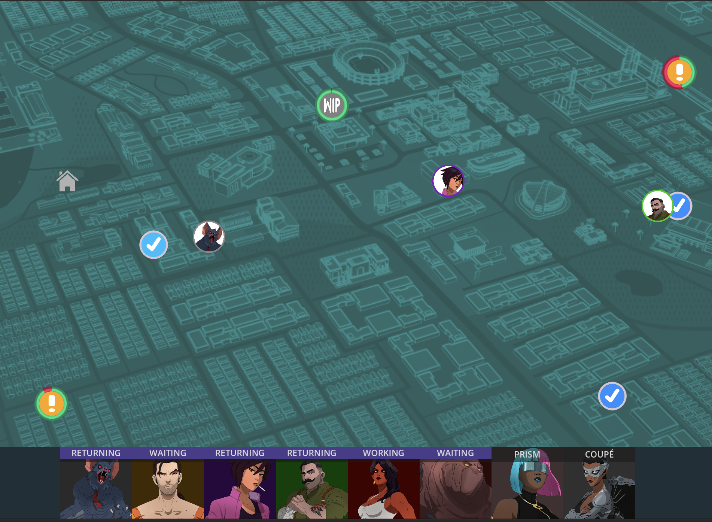
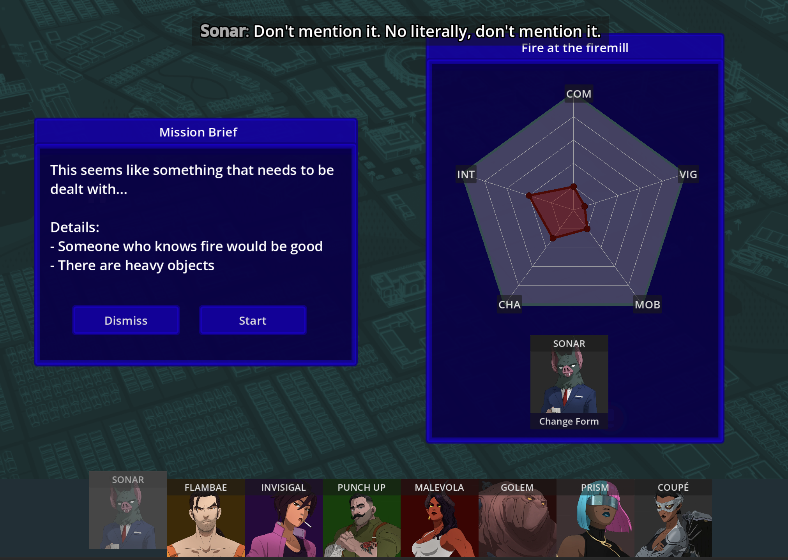

## Outpatch
An open source Dispatch fan game engine

Play the WIP demo online at: [vgmoose.itch.io/outpatch](https://vgmoose.itch.io/outpatch)

## Features
- Overview of incoming missions, and assigning characters to them
- Review results with the bouncing-ball style overlay on the 5 point graph
- 3D hacking mini game, for missions that use it
- Text chirps on assignment and synergy pairs between characters
- Quirks for characters like transformations or passive traits

## Screenshots
| Map | Mission |
|---|---|
|  |  |

## TODO
- VN style cutscenes with characters in between mission
- Support for multiple mission maps, and paths on those maps
- Character exp and menu's to manage and view their stats
- Easier ability to modify game files without rebuilding

## Usage
Most of the customization is designed to be done by editing json text files, or adding in your own image files.

### Characters - `chars.json`
This file uses the character's name as a key, and their attributes as values.

- `stats` - An array of their base stats, out of 10 each, in order: combat, vigor, mobility, charisma, intelligence
- `color` - The web color to use for this character's dialogues and token
- `altName` - Indicates that this character entry is a transformation character. Set it to the value of their non-transformed name. When present, they will be hidden from the character bar
- `flying` - `true` or `false`, whether or not this character flies to their destinations (slight speed boost, moves in a straight line)
- `trait` - One of the characters passive abilities. Current options: `lone-wolf`

### Events - `events.json`
TODO: document this

### Chatter dialogue - `chatters.json`
TODO: document this further

Hybrid key names for synergies use character names in alphabetical order.

### Scene dialogue - `scene.json`
TODO: document this

### Hacking maps - `hacking.csv`
A tab-separated file of the layout of a hacking minigame map. The first part of the file is a physical layout of the grid.

The overall layout of moveable nodes is defined by `x`, and then there are special nodes as well:
- `l<N>` - lock number `N`, promtps for the password and door that go with this lock number
- `p<N>` - node contains the password for lock `N`
- `d<N>` - door for lock `N`, which is opened when the password is given to 

After the layout, there are lines indicating the actual password value (in directionals), and which way the door faces
- `pass <N> <PASSWORD>` - Where `N` is the lock number for this password, and `PASSWORD` is a string of: `u`, `d`, `l`, and `r`
- `door <N> <DIR>` - Where `N` is the lock number for this door, and `<DIR>` is one of: `u`, `d`, `l`, `r`
  - "Doors" are the connection in between two nodes, so that's why it takes a direction, indicating that's where the blocked segment will be, relative to the current node

### General game info - `game.json`
Basic info about the game, to be displayed on the title screen. Also any color tweeks for window, button, or other themeing that is applied at runtime.

## License
This project is available under the [GPLv3](https://choosealicense.com/licenses/gpl-3.0/).

### Human Disclosure
The code and text in this project is 100% written "by hand" and by humans. The Godot game engine is fun and easy to use! See their [Getting Started guide](https://docs.godotengine.org/en/stable/getting_started/introduction/introduction_to_godot.html) for more info.

There's still value in handcrafting stuff and learning new things! If every endeavor were fully automated, then we could just get into our matrix VR pods and live out the rest of our days already.

### Contributing
Likewise, if you want to make contributions back to this repository, please do not use any AI tools.

If you are using it for your own fan game, that decision is up to you. (No restrictions imposed, outside of GPLv3)
